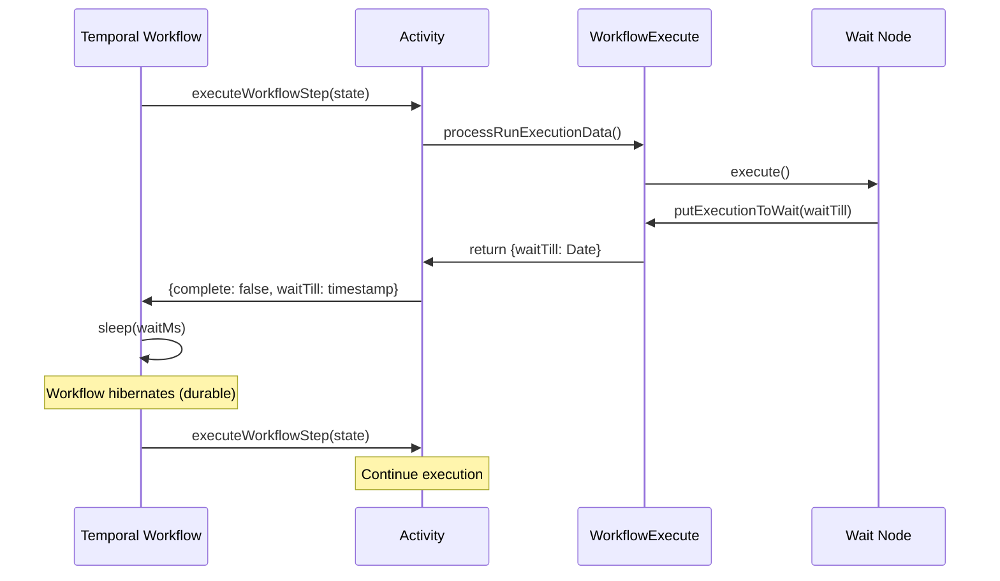

# Wait Node - Temporal Integration

## How It Works

### n8n Wait Node Behavior

The Wait node (`/packages/nodes-base/nodes/Wait/Wait.node.ts`) supports several resume modes:

1. **timeInterval**: Wait for a specified duration
2. **specificTime**: Wait until a specific date/time
3. **webhook**: Wait for an external webhook call
4. **form**: Wait for form submission

For time-based waiting (modes 1 and 2), the node calls:

```typescript
await context.putExecutionToWait(waitTill);
```

This sets `runExecutionData.waitTill` to the target Date.

### Temporal Activity Detection

The `executeWorkflowStep` activity checks for `waitTill` after WorkflowExecute completes:

```typescript
// File: src/activities/execute-workflow-step.ts (lines 97-105)
if (result.waitTill) {
  return {
    complete: false,  // Workflow not done yet
    newRunData,
    executionData: executionBookkeeping,
    lastNodeExecuted: result.data.resultData.lastNodeExecuted,
    waitTill: result.waitTill.getTime(),  // Unix timestamp
  };
}
```

### Temporal Workflow Response

The `executeN8nWorkflow` workflow handles the `waitTill`:

```typescript
// File: src/workflows/execute-n8n-workflow.ts (lines 99-107)
if (result.waitTill) {
  const waitMs = result.waitTill - Date.now();
  if (waitMs > 0) {
    await sleep(waitMs);  // Temporal's durable sleep
  }
  runExecutionData.waitTill = undefined;  // Clear for next iteration
}
```

## Key Benefits of Temporal Sleep

1. **Durable**: Survives worker restarts - no data loss
2. **Efficient**: No polling - worker hibernates during sleep
3. **Accurate**: Temporal guarantees wake-up at the right time
4. **Scalable**: Millions of sleeping workflows don't consume resources

## Limitations (MVP)

- **webhook/form modes not supported**: These require HTTP endpoint setup
- Only time-based waiting (timeInterval, specificTime) works

## Sequence Diagram



## Code Locations

| Component | File | Purpose |
|-----------|------|---------|
| Temporal Workflow | `src/workflows/execute-n8n-workflow.ts` | Orchestration loop with `sleep()` handling |
| Activity | `src/activities/execute-workflow-step.ts` | Node execution with `waitTill` detection |
| Activity Types | `src/types/activity-types.ts` | `ExecuteWorkflowStepOutput` with `waitTill` field |
| Wait Node | `packages/nodes-base/nodes/Wait/Wait.node.ts` | n8n Wait node implementation |

## Testing

Wait node integration is tested in:
- `test/integration/wait-node.test.ts` - E2E test using time-skipping environment

The tests use `TestWorkflowEnvironment.createTimeSkipping()` to avoid actual delays during testing while still validating the complete wait flow.
